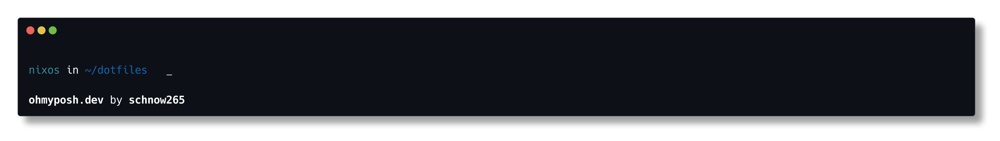

# My Dotfiles

[](https://builtwithnix.org)

> This config assumes that you have the [Nix Package Manager](https://nixos.org/download) and [home-manager](https://nix-community.github.io/home-manager/index.xhtml#sec-install-standalone) installed on your system and the ``git``, ``curl``, ``zip`` and ``unzip`` avaliable in your PATH

## Getting started

Please make a backup of your home-manager config file located in ``~/.config/home-manager`` and remove the original file named ``home.nix`` because the script will symlink my config to that exact file.

After removing your original home-manager config file, you can run

```shell
bash setup.sh
```

This script will also download doomemacs and SDKMAN.

## What is included?

- zsh is the default shell with some [aliases](#aliases) and using zinit as the plugin manager.
- tmux with 'a few' plugins
- my [neovim config](#neovim)
- emacs-git (currently uncommented)
  - Use ``emacs-git`` when you want the latest build, else use ``emacs`` if you don't want to compile emacs from source.
- [Doom Emacs](https://github.com/doomemacs/doomemacs) as the emacs distro used.
- my git config. Please update it to your name and email.
- modified oh-my-posh prompt to not show the git repo status since it would lag the hell out of my prompt.
- [SDKMAN](https://sdkman.io/) configured for use
- Firefox Nightly

## What you kinda need to do yourself

- my 


## My "special" configs

### The Prompt



### NeoVim

#### Plugins

- LuaLine
- lazy-lsp
- Nord color scheme
- nvim-telescope
- neo-tree
- which-key
- neogit
- barbar
- automkdir
- cheatsheet.nvim
- alpha-nvim dashboard
- JABS.nvim
- oil.nvim
- usage-tracker

#### Keybinds

- Leader is ``;`` (also openes which-key)
- NeoTree can be toggled with ``; x``
- Telescope Bindings
  - ``; ff`` to find files
  - ``; fg`` to do live grep
  - ``; fb`` to search the opened buffers
  - ``; fh`` to search help tags (no idea what that is)

#### Other Configs

```lua
vim.o.number = true -- show line numbers
```

### Aliases

| Alias           | original command                             |
| --------------- | -------------------------------------------- |
| ``ll``          | ``lsd -Al``                                  |
| ``ls``          | ``lsd``                                      |
| ``update``      | ``sudo nixos-rebuild switch; nix store gc``  |
| ``update-home`` | ``home-manager switch; nix store gc``        |
| ``cls``         | ``clear``                                    |
| ``fzf``         | ``fzf --preview='cat {}'``                   |
| ``cd``          | ``z``                                        |
| ``emacs``       | ``emacs -nw``                                |
| ``doom``        | ``~/.config/emacs/bin/doom``                 |
| ``rsync``       | ``rsync --progress``                         |
